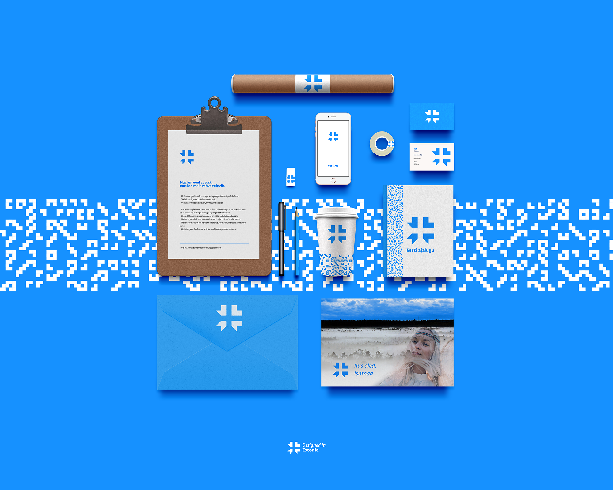

# [Northeast by Veli](http://veli.ee/northeast/)
Northeast is a logo proposal for the national brand of Estonia. Finalist in the competition "Eesti Märk". Use it to show the world your heritage, if your product or service is created or based in Estonia. 

  
🇪🇪 Symbol essence

## Symbol essence
* Northeast location
*    Cardinal points
*    Cornflower
*    Sun wheel
*    National motif
*    Snowflake
*    Nordic Cross
*    Movement / Engergy
*    Centered
*    Focus
*    IT / click
*    Pixel / digital
*    Cursor
*    Etno / seto
*    Jews' harp
*    Brooch
*    #hashtag
*    Modern / Startup
*    Cross-stich
*    Grain
  

## Brandmark construction
### Symbol
The shape's main idea is to convey the geological and political location of Estonia - Northeast Europe.
### Typography
The wordmark is set in "[Adam](https://www.fatype.com/typefaces/adam)", created by Estonian typographer [Anton Koovit](http://www.korkork.com). 

---

> ## Download & use
> The brand is designed with flexibility to express the strength of Estonian creation in any area possible. 
> Are you using the mark anywhere? [Let me know!](mailto:northeast@veli.ee)

---

Northeast by Veli-Johan Veromann is licensed under a Creative Commons Attribution-NonCommercial 4.0 International License. 

